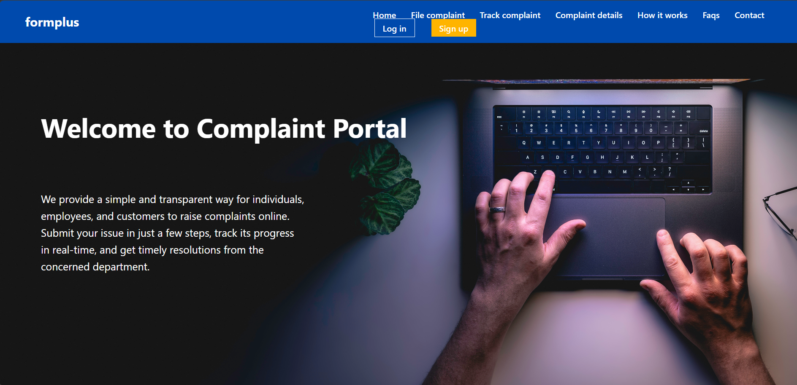
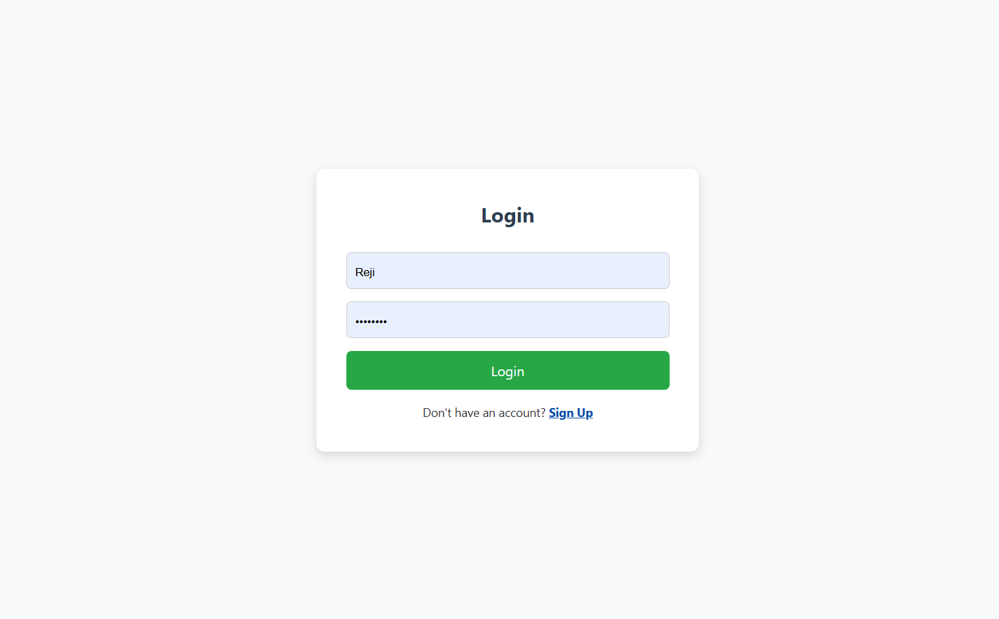
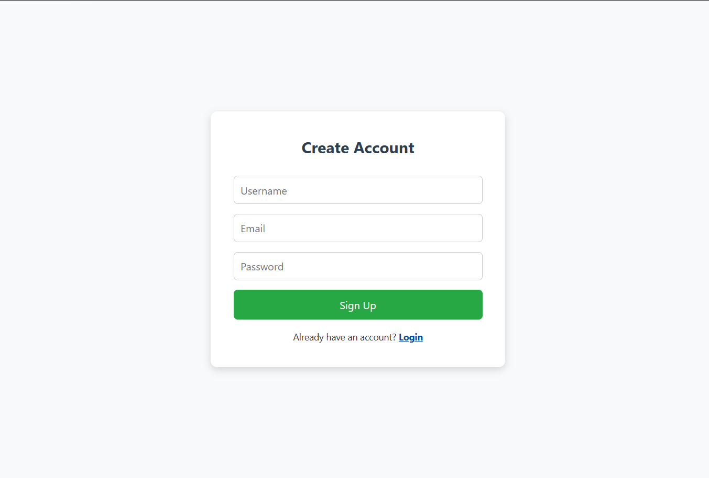
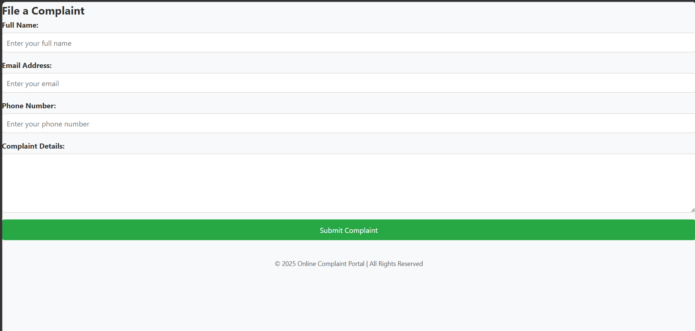

# FormPlus - Online Complaint Portal

A full stack online complaint management system built using Django, HTML, CSS, JavaScript, and MySQL.
The platform allows users to register complaints, manage their complaints, and access complaint-related services through a secure authentication system.

---

## 🚀 Features

### 🔐 Authentication Features

* User Signup
* User Login
* User Logout
* Session-based Authentication
* Dashboard after successful login

### 📋 Complaint Management Features

* Register a new complaint
* View complaint details
* Update existing complaints
* Delete complaints
* User-specific complaint management

---

## 🛠️ Tech Stack

### Frontend

* HTML
* CSS
* JavaScript

### Backend

* Django

### Database

* MySQL

---

## 📂 Project Structure

```bash
## 📂 Project Structure

```text id="sbgx2r"
formplus/
│
├── screenshots/
│   ├── homepage.png
│   ├── login.png
│   ├── signup.png
│   └──complaint-form.png
│  
├── formplus/
│
├── mainapp/
│   ├── templates/
│   ├── static/
│   ├── migrations/
│   ├── views.py
│   ├── models.py
│   └── urls.py
│
├── manage.py
├── README.md
└── .gitignore
```


## ⚙️ Installation & Setup

### 1️⃣ Clone the Repository

```bash
git clone https://github.com/teenatom17/online-complaint-portal.git
```

### 2️⃣ Navigate to Project Folder

```bash
cd online-complaint-portal
```

### 3️⃣ Create Virtual Environment

```bash
python -m venv venv
```

### 4️⃣ Activate Virtual Environment

#### Windows

```bash
venv\Scripts\activate
```

### 5️⃣ Install Dependencies

```bash
pip install django mysqlclient
```

### 6️⃣ Run Migrations

```bash
python manage.py makemigrations
python manage.py migrate
```

### 7️⃣ Start Development Server

```bash
python manage.py runserver
```

---

## 📸 Screenshots

### Homepage



---

### 🔐 Login Page



---

### 📝 Signup Page



---

### 📋 Complaint Registration Form



---

---

## 🔮 Future Enhancements

* Complaint status tracking
* Admin dashboard
* Email notifications
* Complaint categorization
* Responsive mobile support

---

## 👩‍💻 Author

Teena Tom

---
